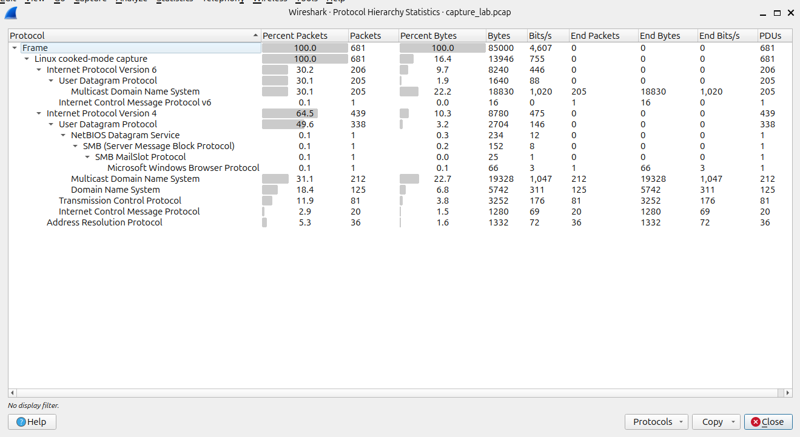
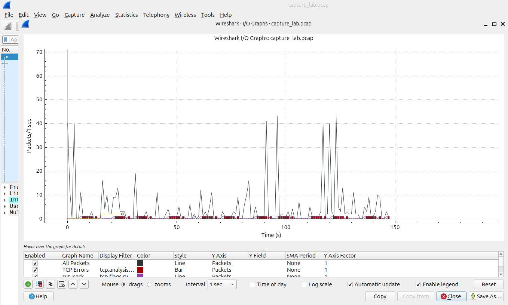
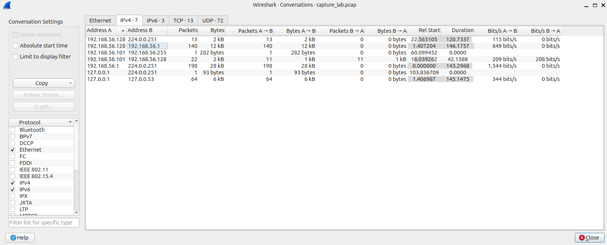
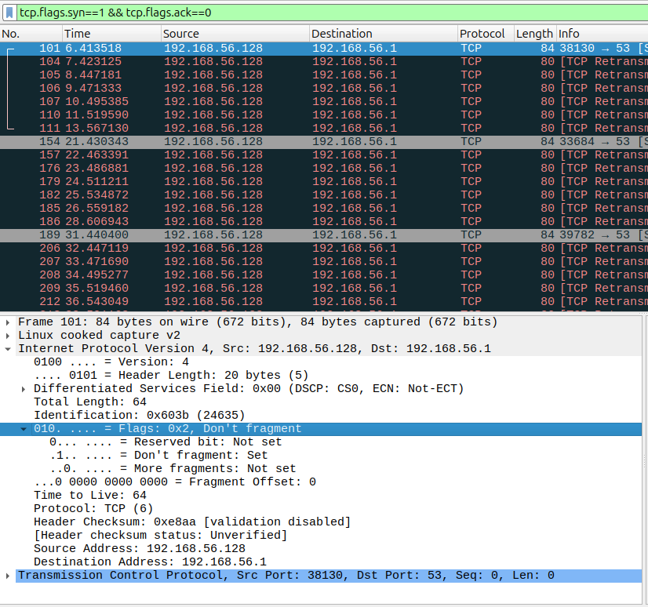

# traffic-capture-lab
Traffic Capture Mini lab
## Analysis Screenshots

### Figure 1 — Protocol Hierarchy

**Figure 1:** Breakdown of captured traffic — heavy UDP (DNS/mDNS), significant IPv4 activity, plus TCP/ICMP/ARP from scan & ping.

---

### Figure 2 — I/O Graph (SYN & ICMP spikes)

**Figure 2:** SYN/ICMP spikes showing port-scan and ping activity.

---

### Figure 3 — Conversations (Top talkers)

**Figure 3:** Top talkers: attacker (192.168.56.128) → victim (192.168.56.1), consistent with scanning.

---

### Figure 4 — SYN packets (details)

**Figure 4:** Repeated SYNs and retransmissions to dst port 53 — scanning attempts without TCP handshake completion.
